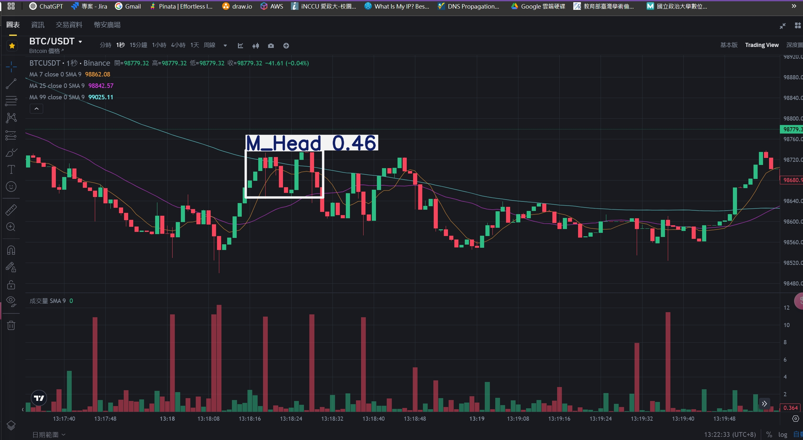

# StockMarketMonitor
一個即時監控股票市場資訊的系統，具備以下功能：
- 動態繪製股票數據圖表  
- 即時螢幕監控市場變化  
- 結合預測模型進行數據分析

---

## 📊 圖表展示
下圖展示系統所產生的即時市場圖表：

---

## 🔍 系統功能概覽
- **TradingView 數據整合**：透過即時串接市場數據，提供即時價格波動視覺化。
- **螢幕即時監控**：利用程式截取與分析價格變化。
- **模型預測功能**：內建預測模型，分析市場走勢。

